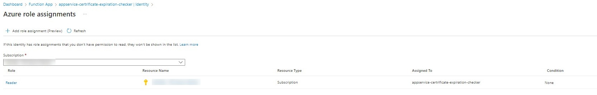
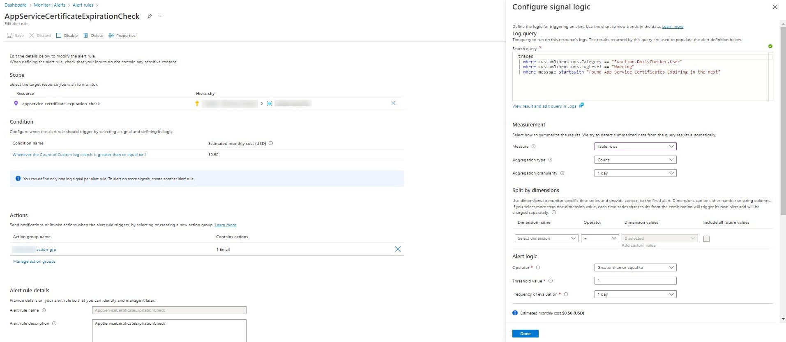

# Azure App Service Certificate expiration checker

Run [Azure Resource Graph](https://learn.microsoft.com/en-us/azure/governance/resource-graph/overview) API daily by using [Azure Functions TimerTrigger](https://learn.microsoft.com/en-us/azure/azure-functions/functions-bindings-timer?tabs=in-process&pivots=programming-language-csharp) to check [App Service Certificate](https://learn.microsoft.com/en-us/azure/app-service/configure-ssl-certificate?tabs=apex%2Cportal) status.
If a certificate that is about to expire is found, alert notification will send using [Azure Monitor](https://learn.microsoft.com/en-us/azure/azure-monitor/alerts/alerts-types#log-alerts)

## Usage

1. Enable [Managed Identity](https://learn.microsoft.com/en-us/azure/app-service/overview-managed-identity?toc=%2Fazure%2Fazure-functions%2Ftoc.json&tabs=portal%2Chttp) for Function App

2. Assign Subscription's built in [Reader](https://learn.microsoft.com/en-us/azure/role-based-access-control/built-in-roles#reader) Role to above id.

    

3. Edit AppSettings of Function App

   - `subscriptionId` : target subscription to check
   - `expireThreshold` : expire threshold days, default 90

4. Setup Azure Monitor log alert

    
